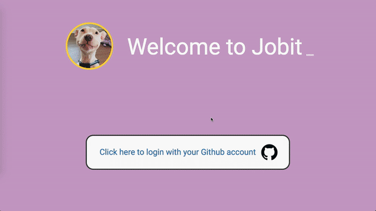

# Job-It-Web-App
## About
Jobit is an application to track employment opportunities.

## Features
- Responsive web design with web and mobile views
- Drag and drop functionality
- User Authentication via Github

## Setup
1.  `npm install`
2.  `npm run react-dev`
3.  `npm run server-dev`

## Technologies Used
### Client
- React
- React Router
- Interact JS
- React Boostrap (Components and Stying)
- React Date Picker
- React Modal (Modals to display forms)
- Moment.js

### Server
- Node.Js
- Express
- 
- Passport.js
- Passport Github2 Strategy
- Express Session
- Cookie Parser

### Database
- Mongo.db
- Mongoose ODM
- 
### Misc
- Dot Env (For Environment Variables)
- Axios (Client and Server Requests)
